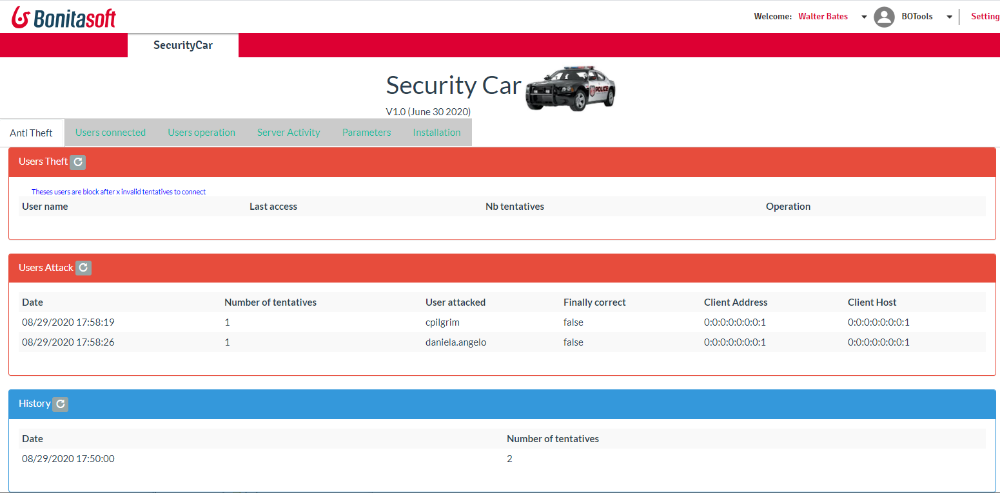

# page_securitycar

This page is an administrative page to manage users, and detect attack on user. An attack is define by a number of tentative to access an user account.
After X tentative, the user account is disabled for security reason.

Administrator can see:
* the last attack on user
* see who are currently connected
* can manage user privilege, like enable/disable an user, reset the password.

# How to Install the function?
The function is compose by a custom page and filters. 
1. Install filters
	Stop the Bonita Engine
	Copy the library SecurityCar<version>-Filter.jar under the web application library (<TOMCAT>/webapps/bonita/WEB-INF/lib for Tomcat for example)
	
	Modify the web.xml, add these three component:
	
	<!-- SecurityCar Filter -->
	  <filter>
        <filter-name>SecurityCarFilter</filter-name>
        <filter-class>org.bonitasoft.securitycar.server.SecurityCarFilter</filter-class>
    </filter>
    
    <!-- SecurityCar mapping -->
	 <filter-mapping>
        <filter-name>SecurityCarFilter</filter-name>
        <url-pattern>/portal/*</url-pattern>
		<url-pattern>/bonita/*</url-pattern>
	</filter-mapping>
	
	<!-- SecurityCar Listener -->
	 <listener>
		<listener-class>org.bonitasoft.securitycar.server.SecurityCarListenerSession</listener-class>
	</listener>
	
2. Download the page, and install it in a Profile or an Application.